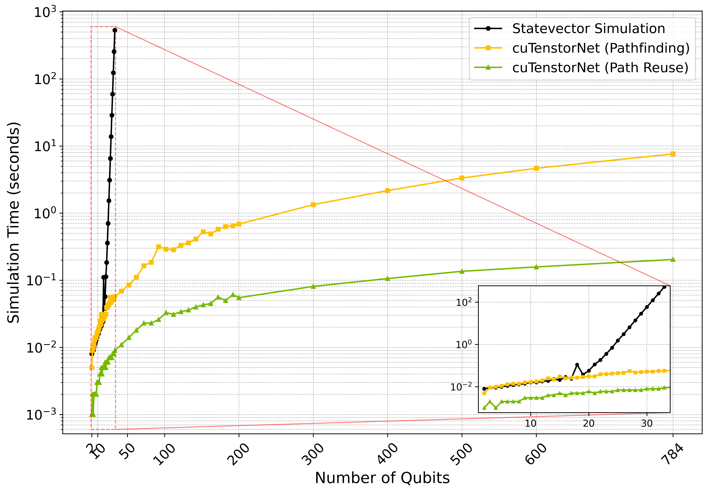
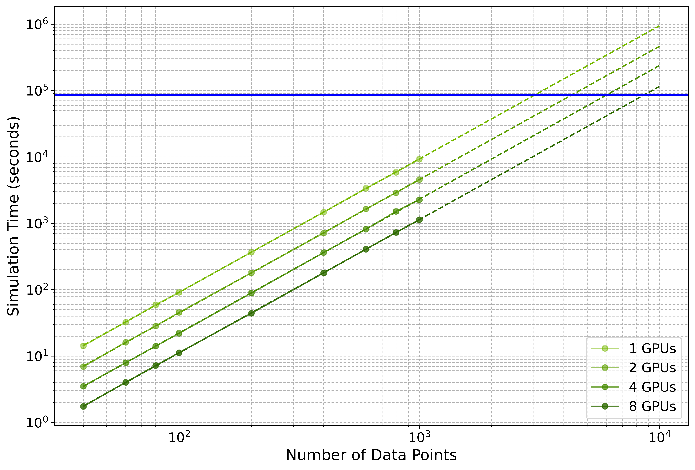

[](https://opensource.org/licenses/Apache-2.0)
[](https://arxiv.org/abs/2405.02630)

## cuTN-QSVM: cuTensorNet-accelerated Quantum Support Vector Machine with cuQuantum SDK


Welcome to the official repository of cuTN-QSVM, featuring fast GPU simulators for benchmarking Quantum Support Vector Machines (QSVMs) and scripts for generating compatible quantum circuits for hardware execution. Facilitated by NVIDIA's [cuQuantum SDK](https://github.com/NVIDIA/cuda-quantum/tree/main) and the [cuTensorNet](https://docs.nvidia.com/cuda/cuquantum/latest/cutensornet/overview.html) library, this project integrates cutting-edge quantum computing technologies with high-performance computing systems, enhancing quantum machine learning's efficiency and scalability to new heights.

## Project Overview
Quantum Support Vector Machines (QSVMs) utilize a quantum-enhanced approach to tackle complex, multidimensional classification problems, surpassing the capabilities of classical SVMs under certain conditions. However, prior to the advent of large-scale quantum systems, the scalability of simulating QSVMs on CPUs was traditionally limited by the exponential growth in computational demands as qubit counts increased. By employing NVIDIA's cuQuantum SDK and the cuTensorNet library, cuTN-QSVM effectively reduces this computational complexity from exponential to quadratic. This enables the simulation of large quantum systems of up to 784 qubits on the NVIDIA A100 GPU within seconds.

Technical Highlights:

- Efficient Quantum Simulations:  The cuTensorNet library significantly lowers the computational overhead for QSVMs, facilitating rapid and efficient quantum simulations that can handle extensive qubit counts.
- Multi-GPU Processing: Supported by the Message Passing Interface (MPI), our implementation allows significant reductions in computation times and scalable performance improvements across varying data sizes.
- Empirical Validation: Through rigorous testing, cuTN-QSVM achieves high classification accuracy, with results reaching up to 95% on the MNIST dataset for training sets larger than 100 instances, markedly outperforming traditional SVMs.

<div style="text-align:center">
    
    
</div>


<a name="quickstart"></a>

## Quick Start 


### Installation
```
conda create -n cutn-qsvm python=3.10 -y
conda activate cutn-qsvm
```
```
git clone https://github.com/Tim-Li/cuTN-QSVM.git
cd cuTN-QSVM
pip install -r requirements.txt 
```
You can also use [NVIDIA cuQuantum Appliance >= 23.10](https://catalog.ngc.nvidia.com/orgs/nvidia/containers/cuquantum-appliance)

```
# pull the image
docker pull nvcr.io/nvidia/cuquantum-appliance:23.10

# launch the container interactively
docker run --gpus all -it --rm nvcr.io/nvidia/cuquantum-appliance:23.10
```

### Quick Environment Check
The env_check.py script is crafted to swiftly verify that your computational environment is optimally configured to execute simulations with cuTN-QSVM, leveraging the capabilities of cuQuantum and Qiskit. This Python script generates a random quantum circuit using Qiskit, then converts it to Einstein summation format utilizing cuQuantum's CircuitToEinsum with the CuPy backend. This process allows you to assess the integration and performance of these essential tools on your system. To run this script and ensure all necessary libraries are correctly interacting and prepared for more complex operations, execute the following command in your terminal:

```
python env_check.py
```
### cuTN-QSVM demo code
You can check with [cuTN-QSVM demo code](qsvm_simulation_demo.ipynb) to kenow the detail of QSVM simulation with tensornetwork.


### cuTN-QSVM with single GPU
```
python benchmark/banchmark_qsvm_tnsm.py
```

### cuTN-QSVM with multi GPU
```
mpirun -np 8 python benchmark/banchmark_qsvm_tnsm-mpi.py 
mpirun -np 4 python benchmark/banchmark_qsvm_tnsm-mpi.py 
mpirun -np 2 python benchmark/banchmark_qsvm_tnsm-mpi.py 
mpirun -np 1 python benchmark/banchmark_qsvm_tnsm-mpi.py 
```

## Methodology
### [cuTensorNet](https://docs.nvidia.com/cuda/cuquantum/latest/cutensornet/overview.html)

NVIDIA's [cuQuantum SDK](https://github.com/NVIDIA/cuda-quantum/tree/main) includes cuTensorNet, a key component designed to optimize quantum circuit simulations on NVIDIA GPUs. It reduces computational costs and memory usage by streamlining tensor contractions and simplifying network complexities through its modular APIs. This enhancement enables efficient, large-scale simulations across multi-GPU and multi-node environments, advancing research in quantum physics, chemistry, and machine learning.

<div style="text-align:center">
    
</div>

### Simulation Workflow
In our enhanced QSVM simulation workflow using NVIDIA's cuQuantum SDK, the cuTensorNet module plays a pivotal role. This integration allows for the efficient transformation of quantum circuits into tensor networks, significantly reducing computational complexity from exponential to quadratic with respect to the number of qubits. By leveraging cuTensorNet’s advanced strategies like path reuse and non-blocking multi-GPU operations, we achieve substantial improvements in simulation speed and efficiency, enabling practical, large-scale quantum simulations up to 784 qubits.

<div style="text-align:center">
    
</div>

### Multi-GPU Enable
In our study on distributed simulation within high-performance computing, we expanded QSVM model simulations using a multi-GPU setup to handle a dataset of over 1,000 MNIST images (28x28 pixels, 756 features). Leveraging NVIDIA’s cuStateVector with high-speed [NVLink](https://www.nvidia.com/en-gb/design-visualization/nvlink-bridges/) and [MPI](https://developer.nvidia.com/mpi-solutions-gpus) communication, we achieved significant computational efficiencies and demonstrated a linear speedup in quantum circuit simulations across multiple GPUs in [NVIDIA DGX Platform](https://www.nvidia.com/en-gb/data-center/dgx-platform/).

<div style="text-align:center">
    
</div>

## How to cite

If you used this package or framework for your research, please cite:

```text
@misc{chen2024cutnqsvm,
      title={cuTN-QSVM: cuTensorNet-accelerated Quantum Support Vector Machine with cuQuantum SDK}, 
      author={Kuan-Cheng Chen and Tai-Yue Li and Yun-Yuan Wang and Simon See and Chun-Chieh Wang and Robert Willie and Nan-Yow Chen and An-Cheng Yang and Chun-Yu Lin},
      year={2024},
      eprint={2405.02630},
      archivePrefix={arXiv},
      primaryClass={quant-ph}
}
```
