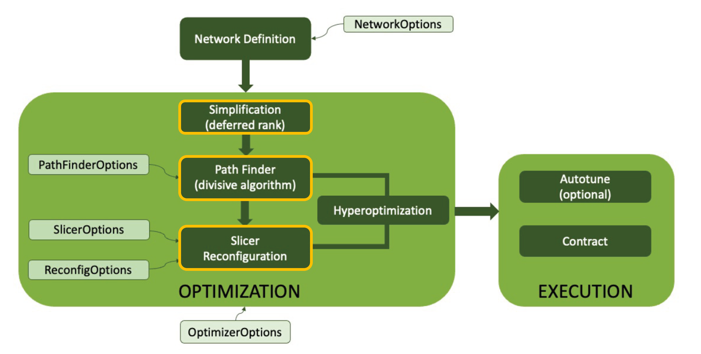
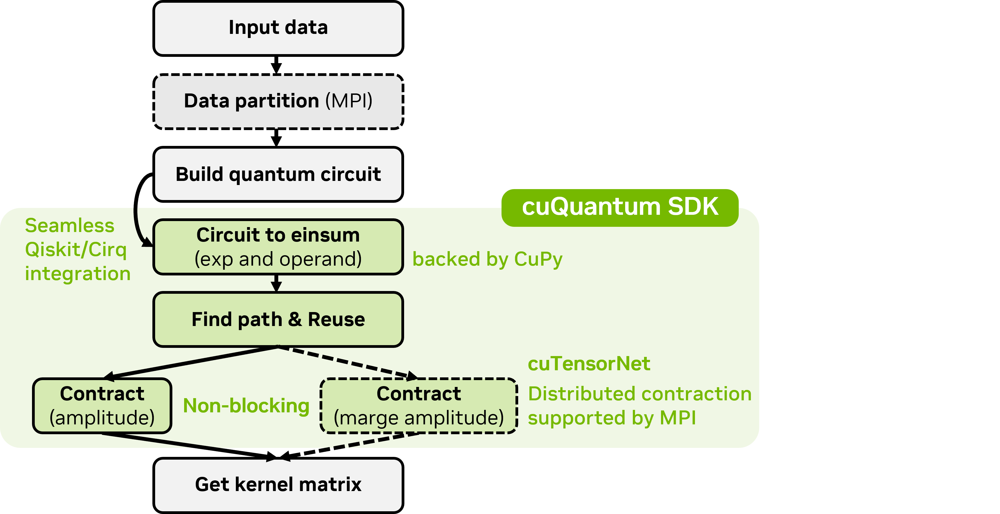
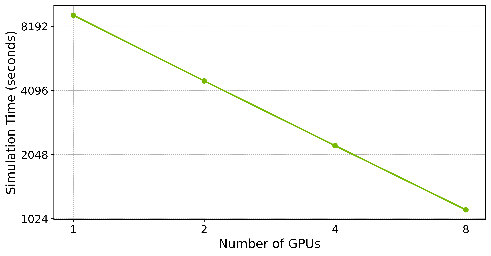

[](https://opensource.org/licenses/Apache-2.0)


## cuTN-QSVM: cuTensorNet-accelerated Quantum Support Vector Machine with cuQuantum SDK
Welcome to the official repository of cuTN-QSVM, an advanced implementation of Quantum Support Vector Machines (QSVMs) facilitated by NVIDIA's cuQuantum SDK through the cuTensorNet library. This project epitomizes the integration of quantum computing technologies with state-of-the-art high-performance computing systems to elevate quantum machine learning to unprecedented levels of efficiency and scalability.

## Project Overview
Quantum Support Vector Machines offer a quantum-enhanced approach to solving complex, multidimensional classification problems, outstripping the capabilities of their classical counterparts under certain conditions. Despite their potential, the scalability of QSVMs is hampered by their exponential growth in computational requirements with increasing qubit counts. cuTN-QSVM leverages cuQuantum SDK's cuTensorNet library to mitigate this challenge, effectively reducing the computational complexity from exponential to polynomial time.

Technical Highlights:

- Efficient Quantum Simulations: Utilizing the cuTensorNet library, cuTN-QSVM drastically reduces the computational overhead of QSVMs, enabling the execution of quantum simulations for systems up to 784 qubits on the NVIDIA A100 GPU within mere seconds.
- Multi-GPU Processing: The implementation supports Multi-GPU processing via the Message Passing Interface (MPI), documenting significant reductions in computation times and demonstrating scalable performance improvements across increasing data sizes.
- Empirical Validation: In empirical assessments, cuTN-QSVM consistently achieves high classification accuracy, reaching up to 95% on the MNIST dataset for training sets exceeding 100 instances, thereby significantly surpassing the performance of traditional SVMs.


<a name="quickstart"></a>

## Quick Start 

### Quick Environment Check
The env_check.py script is crafted to swiftly verify that your computational environment is optimally configured to execute simulations with cuTN-QSVM, leveraging the capabilities of cuQuantum and Qiskit. This Python script generates a random quantum circuit using Qiskit, then converts it to Einstein summation format utilizing cuQuantum's CircuitToEinsum with the CuPy backend. This process allows you to assess the integration and performance of these essential tools on your system. To run this script and ensure all necessary libraries are correctly interacting and prepared for more complex operations, execute the following command in your terminal:

```
python env_check.py
```

### Installation
```
pip install qiskit[visualization]==0.44.2
pip install qiskit-machine-learning==0.6.1
pip install -v --no-cache-dir cuquantum cuquantum-python
pip install pandas
pip install matplotlib
pip install scikit-learn
pip install opt-einsum
```

## Methodology
### cuTensorNet

NVIDIA's cuQuantum SDK includes cuTensorNet, a key component designed to optimize quantum circuit simulations on NVIDIA GPUs. It reduces computational costs and memory usage by streamlining tensor contractions and simplifying network complexities through its modular APIs. This enhancement enables efficient, large-scale simulations across multi-GPU and multi-node environments, advancing research in quantum physics, chemistry, and machine learning.

<div style="text-align:center">
    
</div>

### Workflow
In our enhanced QSVM simulation workflow using NVIDIA's cuQuantum SDK, the cuTensorNet module plays a pivotal role. This integration allows for the efficient transformation of quantum circuits into tensor networks, significantly reducing computational complexity from exponential to quadratic with respect to the number of qubits. By leveraging cuTensorNet’s advanced strategies like path reuse and non-blocking multi-GPU operations, we achieve substantial improvements in simulation speed and efficiency, enabling practical, large-scale quantum simulations up to 784 qubits.

<div style="text-align:center">
    
</div>

### Multi-GPU Enable
In our study on distributed simulation within high-performance computing, we expanded QSVM model simulations using a multi-GPU setup to handle a dataset of over 1,000 MNIST images (28x28 pixels, 756 features). Leveraging NVIDIA’s cuStateVector with high-speed NVLink and MPI communication, we achieved significant computational efficiencies and demonstrated a linear speedup in quantum circuit simulations across multiple GPUs.

<div style="text-align:center">
    
</div>

## How to cite

If you used this package or framework for your research, please cite:

```text
@misc{2024cuTensorNetQSVM,
      title={cuTN-QSVM: cuTensorNet-accelerated Quantum Support Vector Machine with cuQuantum SDK}, 
      author={...........},
      year={2024},
      eprint={2404.13971},
      archivePrefix={arXiv},
      primaryClass={quant-ph}
}
```
