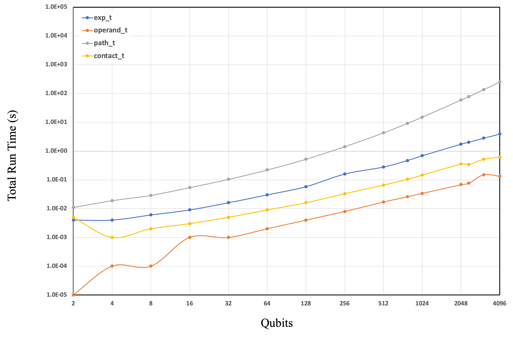

## cutn-qsvm benchmark
### 1. Single Data Pair with Single GPU
```
mpirun -np 1 python banchmark_qsvm_tnsm-mpi_sgpu.py
```


### 2. Multiple Data Pairs with Multiple GPUs
```
#!/bin/bash
#SBATCH -J mgpu -p nchc
#SBATCH --nodes=1 --ntasks-per-node=8 --cpus-per-task=10
#SBATCH --gres=gpu:8
#SBATCH --mem-bind=no

ml purge
ml cuq/12
source /beegfs/_venv/cuq24cu12/bin/activate
mpirun python banchmark_qsvm_tnsm-mpi_mgpu.py
```
#### 1. mgpu with v100


#### 2. mgpu with h100
